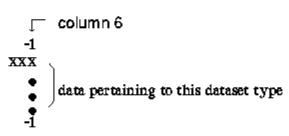

=============================================
Annexe: Description des Datasets UNV reconnus
=============================================

source: http://www.sdrl.uc.edu/universal-file-formats-for-modal-analysis-testing-1/file-format-storehouse

Chaque bloc d'information (ensemble de données) est délimitée par une chaîne
de séparateur, complètement  sauf la colonne 5 et 6, contenant '' -1 ''.

.. _fig-unv_fig001:

Le corps de chaque dataset contient des données qui sont dépendante du
meme dataset. L'enregistrement final de l'ensemble de données contient
une ligne de délimitation contenant ''-1'' dans la colonne 5 et 6.

**Dataset 2411** ::

  Name:   Nodes - Double Precision
  ----------------------------------------------------------------------------
  
  Record 1:        FORMAT(4I10)
                   Field 1       -- node label
                   Field 2       -- export coordinate system number
                   Field 3       -- displacement coordinate system number
                   Field 4       -- color
  Record 2:        FORMAT(1P3D25.16)
                   Fields 1-3    -- node coordinates in the part coordinate
                                    system
   
  Records 1 and 2 are repeated for each node in the model.
   
  Example:
   
      -1
    2411
         121         1         1        11
     5.0000000000000000D+00   1.0000000000000000D+00   0.0000000000000000D+00
         122         1         1        11
     6.0000000000000000D+00   1.0000000000000000D+00   0.0000000000000000D+00
      -1
   
  ----------------------------------------------------------------------------

**Dataset 2412** ::
  
  Name:  Elements   
  ----------------------------------------------------------------------------

  Record 1:        FORMAT(6I10)
                   Field 1       -- element label
                   Field 2       -- fe descriptor id
                   Field 3       -- physical property table number
                   Field 4       -- material property table number
                   Field 5       -- color
                   Field 6       -- number of nodes on element
   
  Record 2:  *** FOR NON-BEAM ELEMENTS ***
                   FORMAT(8I10)
                   Fields 1-n    -- node labels defining element
   
  Record 2:  *** FOR BEAM ELEMENTS ONLY ***
                   FORMAT(3I10)
                   Field 1       -- beam orientation node number
                   Field 2       -- beam fore-end cross section number
                   Field 3       -- beam  aft-end cross section number
   
  Record 3:  *** FOR BEAM ELEMENTS ONLY ***
                   FORMAT(8I10)
                   Fields 1-n    -- node labels defining element
   
  Records 1 and 2 are repeated for each non-beam element in the model.
  Records 1 - 3 are repeated for each beam element in the model.
  ----------------------------------------------------------------------------   
 
Fe descriptors IDs commonly used are: 
   
  **94   Thin Shell Linear Quadrilateral (for 2D surface elements)**
  **115  Solid Linear Brick (for 3D solid elements)**

**Dataset 2477** (According to IDEAS docs, dataset 2467 is obsolete and
 is replaced by dataset 2477) ::

  Name:   Permanent Groups
  Record 1:        FORMAT(8I10)
                   Field 1       -- group number
                   Field 2       -- active constraint set no. for group
                   Field 3       -- active restraint set no. for group
                   Field 4       -- active load set no. for group
                   Field 5       -- active dof set no. for group
                   Field 6       -- active temperature set no. for group
                   Field 7       -- active contact set no. for group
                 **Field 8       -- number of entities in group**
  
  Record 2:        FORMAT(20A2)
                   Field 1       -- group name **(PhysicalVolume - PhysicalSurface)**
  
  Record 3-N:      FORMAT(8I10)
                   Field 1       -- entity type code
                   Field 2       -- entity tag
                   Field 3       -- entity node leaf id.
                   Field 4       -- entity component/ ham id.
                   Field 5       -- entity type code
                   Field 6       -- entity tag
                   Field 7       -- entity node leaf id.
                   Field 8       -- entity component/ ham id.
  
  Repeat record 3 for all entities as defined by record 1, field 8.
  Records 1 to n are repeated for each group in the model.
  Entity node leaf id. and the component/ ham id. are zero for all
  entities except "reference point", "reference point series"
  and "coordinate system".
  
  Example

    2477
      -1
      -1
           0         0         0         0         0         0         0         1
  PhysicalSurface0
           8        33         0         0
           1         0         0         0         0         0         0         1
  PhysicalSurface1
           8        38         0         0
           2         0         0         0         0         0         0         1
  PhysicalSurface2
           8        38         0         0
           3         0         0         0         0         0         0         1
  PhysicalSurface3
           8        43         0         0
      -1
           0         0         0         0         0         0         0         1
  PhysicalVolume0
           8        44         0         0
           1         0         0         0         0         0         0         1
  PhysicalVolume1
           8        45         0         0
  -1
  
  -----------------------------------------------------------------------

