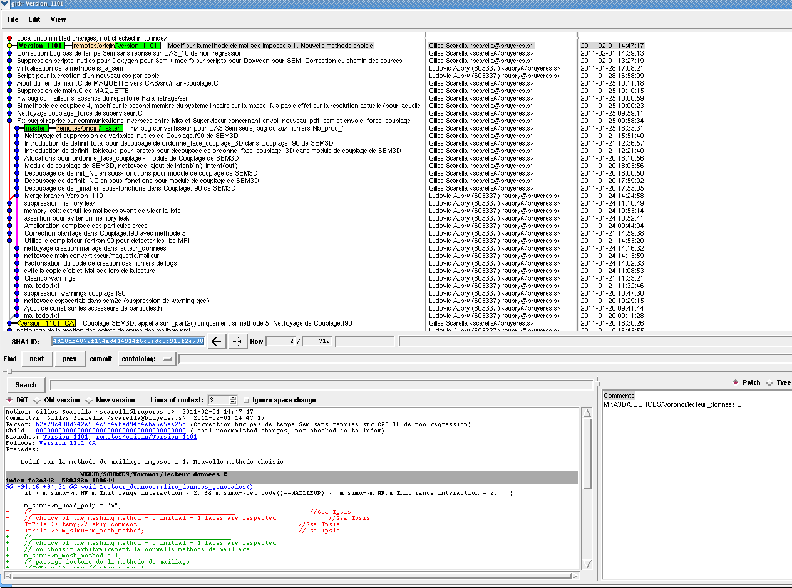

.. -*- mode: rst; coding: utf-8 -*-

================================================
Utilisation du gestionnaire de configuration git
================================================

Introduction
============

- git est disponible sur unix (linux, MacOS) (`gitscm.org <http://gitscm.org>`_) 
  et Windows (`code.google.com/p/tortoisegit/ <http://code.google.com/p/tortoisegit/>`_)

Les commandes de ce tutoriel concerne la version unix, mais sont
également valables si vous utilisez le *shell git* depuis Windows.

- La commande ``gitk`` ouvre une fenêtre permettant de visualiser les
  derniers *commits*, la branche courante, les fichiers modifiés, … On
  l’exécute en faisant ::

    gitk --all &

   Visualisation avec gitk

- Pour configurer ses paramètres (ce qui modifie le fichier ~/.gitconfig) ::

    git config --global user.name "toto"
    git config --global user.email "toto@example.com"

- Sur un terminal couleur, on peut activer les sorties git en couleur :

    git config --global color.ui auto

Démarrage rapide
================

Un exemple minimal d'utilisation de ``git`` tient en quelques lignes ::

   mkdir exemple
   cd exemple
   git init
   cat > test.txt
   Hello world
   ^D
   git add test.txt
   git commit -m "Premiere revision"

Pour aller plus loin il faut regarder les commandes interactives :

- ``git gui`` : permet de faire des commits facilement
- ``gitk`` : permet de naviguer dans l'historique, faire des recherches, etc...
- ``git help`` et ``git xxx --help`` : permet d'obtenir la documentation d'une commande ``xxx``

Pour partager des sources avec d'autres développeurs, il faut commencer par faire un clone d'un répertoire git : ::

  git clone /chemin/du/repertoire_source

Ensuite entre deux répertoires on utilise les commandes ``git push/pull/fetch``

Si on veut une utilisation qui "ressemble" à l'utilisation de ``subversion`` il faut créer un *repository* central
avec ``git clone --bare``

Donc si on part de l'exemple ci-dessus en supposant que le *repository* initial se trouve dans ::

  /home/userA/exemple

et que l'on veut que ``userA`` et ``userB`` utilisent un repository commun sur le compte ``/home/appli``,
on peut faire ::

  userA$ cd /home/appli
  userA$ git clone --bare /home/userA/exemple

L'utilisateur ``userB`` fait ::

  userB$ cd /home/userB/my_sources
  userB$ git clone /home/appli/exemple.git

L'utilisateur ``userA`` peut supprimer le répertoire exemple et le remplacer avec ::

  git clone /home/appli/exemple.git

Ce qui a pour effet d'enregistrer ``/home/appli/exemple.git`` comme repository "remote" ayant pour
nom "origin" ; il est possible de faire la même chose avec la commande ``git remote add xxx`` mais
il faut bien lire la doc avant, et comprendre les subtilités des *refspec*.

Commandes utiles
================

Récupération des sources dans un répertoire de travail
------------------------------------------------------

- Pour cloner un dépôt git dans un répertoire de travail, situé de préférence dans son temp (le répertoire ne doit pas exister) ::

    git clone ~mka3d/mka3d.git ~/temp/<repertoire_de_travail>

Commandes utiles pour les commit
--------------------------------

- Pour voir le statut des fichiers et savoir s’ils sont modifiés par
  rapport au dernier commit, ::

    git status

- Pour voir les différences par rapport au dernier commit, ::

    git diff

- Pour valider des modifications avant un commit ou pour ajouter un
  fichier ne figurant pas dans le dépôt, ::

    git add <fichier>

- Pour sélectionner précisément les parties à committer du fichier ::

    git add –p <fichier>

- Pour supprimer un fichier et le supprimer du dépôt, ::

    git rm <fichier>

- Pour faire un commit avec un message ::

    git commit –m  "Modif sur fichier "

- Pour modifier le message d’un commit ::

    git commit --amend –m " Message "

- Pour annuler une modification non validée par git add et revenir à
  la version du dernier commit du fichier,::

    git checkout <fichier>

Commandes pour modifier un commit
---------------------------------

On peut avoir besoin de modifier un commit, à savoir soit le
fusionner avec un autre ou modifier son message.

- Pour modifier un commit, à savoir changer son message ou le
  fusionner avec un autre, il faut remonter dans l’historique (ici on
  recule de deux versions) ::

    git rebase –i HEAD~2

Faire ensuite edit ou squash et la modification voulue. Au final, pour valider l’opération, ::

    git rebase –continue

- Pour annuler complètement un commit ::

    git reset --hard HEAD^

Commandes pour conserver des modifications sans les enregistrer
---------------------------------------------------------------

- Pour conserver les modifications courantes et les réutiliser plus tard, sans faire de commit ::

    git stash

- Pour lister les modifications en attente ::

    git stash list

- Pour récupérer les modifications en attente ::

    git stash apply

- Pour supprimer les modifications en attente ::

    git stash drop

Detection d’un bug
------------------

La version courante contient un bug, on connaît une autre version qui
ne contient pas ce bug. On peut alors trouver la version qui a
introduit ce bug en utilisant ``git bisect``

- Pour démarrer la recherche : ::

    git bisect

- La version courante est propre et ne rencontre pas le bug : ::

    git bisect good

- La version courante est buggée : ::

    git bisect bad

  git propose alors une version intermédiaire à tester.

- Pour sauter la version courante dans un tel procédé : ::

    git bisect skip

Gestion des branches
--------------------

- Pour lister les branches existantes : ::

    git branch –a

- Pour aller sur une branche : ::

    git checkout <branche>

- Pour créer une nouvelle branche : ::

    git branch new_branch

- Pour fusionner la version courante avec la version de la branche distante : ::

    git merge

Récupération des données committées par les autres utilisateurs
---------------------------------------------------------------

- Pour récupérer les modifications distantes sans fusionner : ::

    git fetch

- Pour recaler la branche courante au niveau de la branche distante
  (permet la mise à jour des fichiers source en tenant compte des
  modifications distantes) ; ::

    git rebase origin/master

- Pour recaler la branche courante au niveau d’une branche distante
  qui n’est pas origin/master : ::

    git rebase origin/Version_1101

- Pour récupérer les commits distants et faire la fusion avec la
  version courante : ::

    git pull

Transmission de ses commits aux autres utilisateurs
---------------------------------------------------

- Pour transmettre (pousser) les modifications aux autres utilisateurs : ::

    git push

- Pour pousser la branche branche_locale sur origin : ::

    git push origin branche_locale

- Pour  transmettre les tags : ::

    git push --tags

- Pour mettre une étiquette sur la version courante : ::

    git tag nom

Précautions
-----------

Après les avoir poussés, il est compliqué de modifier des commits. Il
faut donc utiliser la commande push avec précaution.

