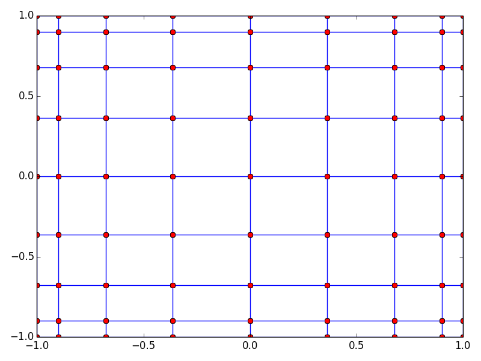
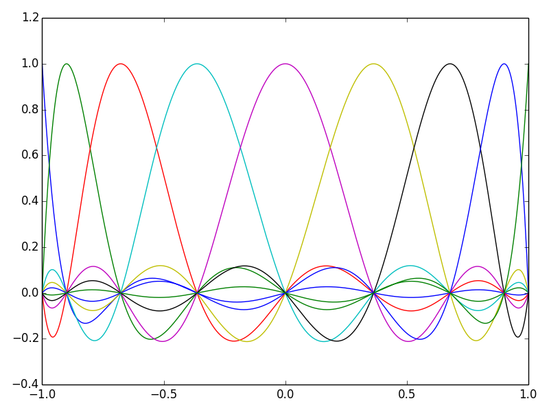
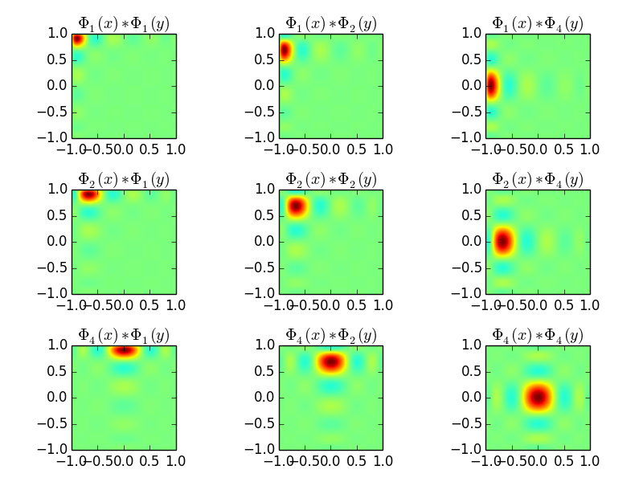

.. -*- mode:rst; coding: utf-8 -*-

======================
Prise en main de SEM3D
======================

Introduction
============

Ce chapitre présente la chaine de calcul SEM, insistant plus
particulièrement sur SEM3D.

La chaîne logicielle SEM contient le code de simulation (``sem2d.exe``
et ``sem3d.exe``, ainsi qu'un outil de partitionnement et préparation
de maillage ``mesher``).

L'outil ``mesher`` permet de partitionner des maillages complexes au
format abaqus, UNV ou encore un format spécifique simple (équivalent
du format UNV dans un fichier HDF5).

Outre la paramétrisation du code SEM3D, la plus grosse difficulté dans
l'utilisation du code concerne la création des maillages, qui doit être
effectuée par des outils spécialisés comme Cubit. Pour des maillages
simples : stratifiés, avec topographie, on peut utiliser la suite
d'outils *meshtools*.

Les équations du mouvement
--------------------------

SEM résoud la propagation d'onde élastique dans un milieu décrit par l'équation
locale du mouvement reliant le déplacement :math:`u` en chaque point matériel, les
contraintes :math:`\sigma` et les forces extérieures :math:`\vec{f}` :

.. math::

   \rho \frac{\partial^2 u}{\partial t^2} = \nabla.\sigma + \vec{f}

Avec en élasticité linéaire : :math:`\sigma=C:\nabla{}u`, où :math:`C` est le
tenseur élastique d'ordre 4.

Pour l'instant les milieux de propagations décrits dans SEM sont
considérés isotropes.  Le code est prévu pour gérer les milieux
anisotropes, mais il n'existe pas de manière simple de gérer la mise
en données.

Dans le domaine fluide, on résoud :

.. math::

   \frac{1}{\kappa}\frac{\partial^2 (\rho\phi)}{\partial t^2} = \nabla.v + ext

   v = \frac{1}{\rho}\nabla(\rho\phi)

Formulation éléments finis
--------------------------

SEM est un code éléments finis, basé sur une formulation spectrale
(d'où son nom). Le champ de déplacement :math:`u` est décrit dans
chaque élément, ou maille, sur une base de polynômes de Lagrange
d'ordre N (N défini comme paramètre).

Méthode spectrale
~~~~~~~~~~~~~~~~~

Pour obtenir une convergence spectrale, ces polynômes de Lagrange sont
définis sur les points de Gauss-Lobato-Legendre (GLL) de chaque
éléments (voir :ref:`fig-gll`).

.. _fig-gll:

   Position des points de Gauss-Lobato-Legendre sur un élément 2D d'ordre 9
   

Les éléments traités sont des quadrangles en 2D et des Hexaèdres en
3D. Si :math:`\Phi_i(x)` est le polynôme de Lagrange valant 1 au point
GLL :math:`x_i`, le champ de déplacement :math:`u(x,y,z)` de l'élément
s'exprime sur la base tensorisée :math:`\Phi \otimes \Phi \otimes
\Phi` :

.. math::

   u(x,y,z) = \sum_{i,j,k} U_{i,j,k}.\Phi_i(x).\Phi_j(y).\Phi_k(z)

Ainsi, sur un élément d'ordre 5, la composante *x* du champ de
déplacement, est décrite par un vecteur de 125 éléments
:math:`U_{i,j,k}` .

La figure :ref:`pollag` montre la forme des polynômes de Lagrange d'ordre 9, la base tensorisée
de dimension 2D est représentée :ref:`fig-ref-2d`

.. _pollag:

   Polynômes de Lagrange d'ordre 9.

.. _fig-ref-2d:

   Quelques fonctions de forme d'un élément 2D d'ordre 9

Le champ de déplacement est continu entre deux éléments adjacents, et
le maillage géré par SEM doit être conforme (toutes mailles se
touchant ont en commun un sommet, ou une arête ou une face
complète). De plus l'ordre en X, Y ou Z de chaque maille doit assurer
la conformité au niveau des points GLL en commun.

Enfin, dans ce qui précède, on a présenté la formulation de manière
simplifiée, sur des mailles cubiques, alignées en *x,y,z*. En pratique
SEM peut gérer un maillage hexaédrique quelconque (mais conforme),
composé de mailles parallélépipédiques. Dans chaque élément le code se
ramène à une base locale :math:`\phi_i(x).\phi_j(y).\phi_k(z)` par
changement de variable de la fonction de base :math:`\Phi` depuis la
maille vers un élément de référence sur le segment [-1.,1.] .

Matrice de masse diagonale
~~~~~~~~~~~~~~~~~~~~~~~~~~

Enfin une des originalités de la méthode, provient du choix de la
quadrature pour l'évaluation numérique des intégrales apparaissant
dans la formulation élément finis.

On passe d'abord à la formulation faible en multipliant l'équation
locale par une fonction quelconque *w* et en intégrant (produit
scalaire dans :math:`\mathcal{L}^2`)

.. math::

   \forall w \in \mathcal{L}^2, \int w.\rho \frac{\partial^2 u}{\partial t^2}\vec{dx} = \int w.(\nabla.(C:\nabla{}u) + \vec{f}).\vec{dx}

En exprimant *w* et *u* sur la même base discrète
:math:`\Phi_i(x,y,z)` (ici *i* indexe **toutes** les fonctions de base
de tous les éléments).

.. math::

   \forall w = \sum_{i=1}^N w_i \Phi_i, w_i \in \mathbf{R}, 
   \sum_{i,j} w_i.\rho \frac{\partial^2 u_j}{\partial t^2}\int \Phi_i\Phi_j \vec{dx} = 
     \sum w_i.u_j.\int (\nabla.(C:\nabla{}\Phi_j) + f_j\Phi_j).\Phi_i \vec{dx}

Cette dernière équation apparaît alors sous la forme classique de
l'approximation de Galerkin : :math:`a(u,w) = f(w)` avec :math:`a` une
forme bilinéaire.

On arrive à l'équation matricielle suivante :

.. math::

    M.\frac{\partial^2 U}{\partial t^2} + K.U = F

Sans aller jusqu'au bout des développements, on voit qu'il apparaît une
matrice :math:`M_{i,j}=\int \Phi_i\Phi_j\vec{dx}`, que l'on doit
inverser si on veut obtenir une expression de :math:`\frac{\partial^2
u_j}{\partial t^2}` .

Les produits scalaires entre fonctions :math:`\Phi_i` qui ne partagent
pas le même élément support sont nuls par construction. Mais au sein
d'un éléments, les polynômes de Lagrange ne sont pas orthogonaux. La
méthode SEM utilise astucieusement une quadrature basée sur les mêmes
points de Gauss que les noeuds de définitions des fonctions de
base. Cela introduit bien sûr une approximation de l'intégrale, mais
le résultat est que le produit scalaire discret utilisé rend
orthogonale les fonctions :math:`\Phi_i` ayant le même élément
support.

Conditions de bord
------------------

La condition naturelle d'un bord en élément fini est d'être une
surface libre, donc réfléchissante pour les ondes. Pour simuler des
milieux ouverts, SEM implémente un type d'élément dit PML (Perfectly
Matched Layer) pour simuler un milieu ouvert infini en bordure d'un
domaine.

Intégration temporelle
----------------------

Le schéma d'intégration est un schéma de Newmark explicite.

Le pas de temps d'intégration dans SEM est calculé automatiquement à
partir du nombre de Courant :math:`\mathcal{C}<1` (paramètre de configuration) selon :

.. math::

   \Delta t = \mathcal{C} \frac{\min \Delta{x}}{\max Velocity}

Attention:

   Des mailles trop petites, ou des vitesses de propagation trop
   importantes vont faire chuter le pas de temps.

Résolution spatiale
-------------------

Le maillage doit également être suffisement résolu pour capturer les
fréquences spatiales du signal que l'on veut propager. On considère
que 10 points GLL par longueur d'onde sont suffisant.

Augmenter l'ordre des éléments est donc un moyen d'obtenir une
résolution spatiale correcte avec un maillage donné. La convergence
spatiale étant rapide, augmenter l'ordre devrait permettre de baisser
le nombre de points par longueur d'onde nécessaire, mais cela augmente
doublement les coûts de calcul :

- la complexité est en :math:`N^3` par points GLL,

- le pas de temps est proportionnel à :math:`\frac{1}{\min \Delta x}`,
  le pas d'espace :math:`\min \Delta x` diminuant avec l'ordre des
  éléments (On voit sur :ref:`fig-gll` comment les points de Gauss se
  ressèrent vers les bords avec l'augmentation de l'ordre.

Atténuation
-----------

Un mécanisme d'atténuation sismique des ondes P et S est implémenté,
sous forme d'une série de filtres répartis sur une bande de
fréquence. (voir [KOM98]_)

Description des sorties
-----------------------

Les résultats de simulation peuvent être obtenus sous deux formes :

- Des instantanés (*snapshot*) des champs obtenus sur tous les points GLL, ou sur
  un sous-partie, à une fréquence données. Ces sorties sont en général
  assez lourdes et ne peuvent être trop fréquentes.

- Des sorties *capteurs*, pour un ou plusieurs points du maillage, on
  sort les valeurs du champ toutes les N itérations de calcul.

Les champs disponibles sont :

============= ====== ======== ========
Champ         Milieu Snapshot Capteurs
============= ====== ======== ========
Déplacement   S      Oui      Oui
Vitesse       S/F    Oui      Oui
Accélération  S/F    Oui      Non
Pression      S/F    Oui      Non
============= ====== ======== ========

Pour les instantanés, il existe un mécanisme de sélection de mailles
qui permet de ne sauvegarder qu'une partie du maillage. Cependant on
ne peut sélectionner que des mailles complètes (donc avec tous ses
points GLL), et pour l'instant, on ne peut pas, sauf en
post-traitement, réinterpoler les fonctions de formes sur un maillage
plus grossier.

Présentation des outils
=======================

Deux exécutables sont impliqués directement dans l'utilisation de SEM :

- ``mesher`` et ``sem3d.exe`` pour le cas 3D,

- ``sem2d.exe`` pour le cas 2D, il n'existe pas encore d'outil de
  partitionnement simple à utiliser.

``mesher`` transforme un maillage d'entrée en un maillage partitionné
utilisable par SEM. On peut lui fournir différents formats :

- Un maillage au format *Abacus* (d'extension ``.aba``)

- Un maillage au format *UNV*, (aussi connu sous le nom *IDEAS*)
  d'extension ``.unv``, contenant des hexaèdre pour la 3D.

- Un maillage au format *HDF5*, spécifique, dont la structure est
  décrite en détail dans :ref:`Format HDF5`.

- Le quatrième format est simplement la description d'un maillage
  cartésien, pour lequel on entre manuellement les coordonnées et la
  subdivision de la grille souhaitée.

L'outil mailleur, en plus de ses entrées en ligne de commande,
s'appuie sur un fichier externe ``mat.dat``, donnant quelques
informations sur le maillage à générer : nombre de matériaus, présence
d'éléments PML, type de matériau (solide ou fluide).

Préparation d'un cas de calcul
------------------------------

Pour lancer un calcul SEM, il faut se placer dans le répertoire du cas et y placer
les fichiers nécéssaires à son exécution. L'arborescence doit être la suivante ::

  CAS/
  |- input.spec
  |- material.input
  |- sem/
  |  |- mesh4spec.0000
  |  |- ...
  |  |- mesh4spec.NNNN
  |- capteurs.dat

``input.spec`` :

  Ce fichier contient la configuration du code :
  - paramètres d'intégration temporelle, temps physique du calcul,
  - description de la ou des sources,
  - description des sorties capteurs,
  - description des sorties snapshots.

``material.input`` :

  Ce fichier contient la description de chaque matériau : :math:`\rho, V_p, V_s`, un nombre
  de points GLL par direction de la maille de référence.

  Le format du fichier est le suivant :
  
  - la première ligne contient le nomnbre de milieux décrits
  
  - Une ligne par milieu, contenant :
  
    - le type de milieu (Solide, Fluide, PML solide (P)m PML fluide (L) )
  
    - Les vitesses d'ondes P, et S
  
    - La densité
  
    - L'ordre des éléments en X, Y, Z (Y est ignoré en 2D)
  
    - Un pas de temps (ignoré dans la version actuelle)
  
    - Les attenuations d'ondes P et S
  
  - 2 lignes de commentaires
  
  - Pour chaque milieu de type PML (donc P ou L), une ligne indiquant les directions d'atténuation,
    et le type d'attenuation :
  
    - Un caractère pour le type de PML (filtrante (T), ou standard (F))
  
    - paramètres n et A pour les PML filtrantes
  
    - 3 couples de deux drapeaux T ou F (pour True False) indiquant si la PML attenue dans
      les directions X, Y et Z respectivement (premier flag du couple) et dans le sens positif (T)
      ou négatif de l'axe.
  
    - La fréquence de coupure en cas de PML filtrante
  
  Exemple ::
  
    27
    S  6300.00  2500.00   2800. 5   5    5  0.000005 0. 0.
    P  6300.00  2500.00   2800. 7   7    5  0.000005 0. 0.
    P  6300.00  2500.00   2800. 7   7    5  0.000005 0. 0.
    # PML properties
    # Filtering? npow,Apow,X?,left?,Y?,Forwrd?,Z?,down?,cutoff freq
    F 2 10. T T T T F F 0.
    F 2 10. T F T T F F 0.

``capteurs.dat`` :

  Contient une description des sorties capteurs souhaitées.

Le fichier ``input.spec`` est décrit en détail dans la section
_`Description des paramètres de SEM3D`.

Des exemples de fichiers `material.input` et `capteurs.dat` sont
disponibles dans les tests du code. Ces derniers sont de simples
tables de paramètres.

Exemples de modélisation avec SEM3D
===================================

Maillage uniforme avec PML
--------------------------

On commence par un premier exemple de grille cartésienne avec une
source ponctuelle.

Le fichier ``mat.dat`` doit contenir (les commentaires, après le *#*
sont facultatifs) ::

  1  # number of non PML materials
  F  # Milieu stratifié F: non T: oui
  1  # PMLs? 0: no, 1: yes
  1 1  # PMLs on top? at the bottom? (0: no, 1: yes)
  S

On lance l'exécutable ``mesher``, et on lui indique les informations
suivantes :

- Nombre de processeurs : 4

- Construction du modèle matériaux et maillage : 1 (Oui)

- Choix d'une grille : 1 (On the fly : sur la mouche)

- Saisie des coordonnées et taille de maille : 

  - X : -100, 500
  - Y : -100, 500
  - Z : -100, 500

  - DX, DY, DZ : 50

- Choix de 8 noeuds par maille : 1 (Les mailles quadratiques à 27
  noeuds sont en développement)

L'outil va alors générer 4 fichiers nommés ``mesh4spec.000N.h5``
(N=0,1,2,3) contenant les maillages et informations de communication
des 4 partitions.

Lancement du cas
----------------

Il faut d'abord préparer le répertoire du CAS : y copier les fichiers
``input.spec``, ``material.input``, ``capteurs.dat``, et placer les fichiers
``mesh4spec.NNNN`` dans le sous-répertoire ``sem/``.

On doit obtenir l'arborescence suivante ::

  mon_cas/
  |- input.spec
  |- material.input
  |- capteurs.dat
  |- mat.dat
  |- sem/
  |  |- mesh4spec.0000.h5
  |  |- mesh4spec.0001.h5
  |  |- mesh4spec.0002.h5
  |  |- mesh4spec.0003.h5

Visualisation des résultats
---------------------------

Les résultats sont de deux sortes :

- Des instantanés (mot-clef *snapshot* du fichier de config)
  sauvegardés dans le répertoire ``res/`` : les sorties sont au format
  HDF5, directement visualisables avec **paraview**, ou ensight en
  ouvrant le fichier ``.xmf`` associé (Format XDMF).

- Des sorties capteurs, au format texte ou hdf5 (paramétrable par
  fichier de config).  Le format HDF5 n'a d'utilité que pour un grand
  nombre de capteurs sur des systèmes de fichier distribués.

Protection reprise
------------------

Il est possible de reprendre le calcul après un arrêt à partir de la dernière *protection*.
Les fichiers de protection sont des répertoires placés dans le répertoire ``prot`` et portant
le numéro de l'itération de protection.

Pour relancer le calcul à partir d'une protection, il faut renseigner le numéro d'iteration
avec le mot-clef ``restart_iter`` et indiquer que l'on veut redémarrer depuis une reprise :
mot-clef ``prorep`` valant ``true``.

Le mot-clef ``prorep_iter=NIT`` indique au code d'effectuer une protection toutes les ``NIT`` itérations.

Maillage d'une topographie
==========================

Génération du maillage
----------------------

Pour générer ce cas on va utiliser un jeu d'outils externes à SEM : *meshtools*.

Les étapes de construction sont les suivantes :

- Sélection d'un ou plusieurs fichiers de topographie (format SRTM par exemple) (*utilisateur*)

- Conversion/concaténation de la topographie en un format compact intermédiaire (*mt_import*)

- Création d'une grille cartésienne dans la projection souhaitée (*mt_grid*)

- (optionel) Création de grilles supplémentaires pour mailler des couches en profondeur épousant la topographie
  de surface (*utilisateur*)

- Génération du maillage et du fichier matériau associé (*mt_topo*)

- Partitionnement du maillage (*mesher*)

Nous allons traiter un exemple de génération de maillage à partir d'un fichier srtm ::

  # On decompresse le fichier srtm
  $ unzip srtm_56_01.zip
  # On convertit le fichier au format hdf5 (lat/lon)
  $ mt_import -s topo_srtm.h5 srtm_56_01.tif
  # On projete une grille de 30x30 mailles de 1000x1000 m de cote d'origine 58N 96E dans la projection aeqd
  $ mt_grid --vx=1000,0 --vy=0,1000 -g 30,30 -p "+proj=aeqd +lat_0=58.0 +lon_0=96.0" -n surf topo_srtm.h5 grid.h5
  $ mt_grid --vx=500,0 --vy=0,500 -g 300,300 -p "+proj=aeqd +lat_0=58.0 +lon_0=96.0" -n surf topo.h5 grid.h5
  # Le fichier contenant la grille est utilise pour creer un maillage
  $ mt_topo --npml=1 --profile=mesh.profile --mat=input_material.dat grid.h5 mesh_sem.h5
  # on renomme le fichier materiau (pour l'outil mesher)
  $ cp mesh_sem.h5.mat material.input
  $ mesher
  256
  0
  4
  1
  mesh_sem.h5
  $ mkdir sem
  $ mv mesh4spec.0* sem/
  # Lancement du cas sem
  $ mpirun -n 256 sem3d.exe

Modification de l'association des matériaux
-------------------------------------------

L'outil ``mt_topo`` via le fichier de profil vertical (option ``--profile``) applique une description
de milieu homogène par couche de mailles (pas de variation en X et Y).

On peut cependant aller plus loin et modifier le maillage généré avec quelques lignes de script python ::

  $ python
  # import des fonctions numpy
  >>> from numpy import *
  # Import du module de lecture de fichier HDF5
  >>> import h5py
  # Ouverture du fichier
  >>> fmesh = h5py.File("mesh_sem.h5","r+")
  # On lit les coordonnees des noeuds (taill Np x 3)
  >>> nodes = fmesh["/Nodes"][...]
  # On charge les proprietes materiau (taille Nel)
  >>> mat = fmesh["/Mat"][...]
  # On charge la description des elements Nel x 8
  >>> elem = fmesh["/Elements"][...]
  # On calcule le centre de chaque element nodes[elem,:] est un tableau
  # de taille Nel x 8 x 3, on fait la moyenne des coordonnees sur l'axe du milieu
  >>> ctr = nodes[elem,:].sum(axis=1)/8.
  # on applique un nouveau materiau sur la zone d'interet :
  >>> z1 = logical_and( ctr[:,0] > 5000, ctr[:,0] < 10000. )
  >>> z2 = logical_and( ctr[:,1] > 2000, ctr[:,1] < 4000. )
  >>> z3 = ctr[:,2] > -5000
  # Un tableau de booléen de taille Nel tq les valeurs true correspondent aux
  # élements de centre 5000<X<10000 , 2000<Y<4000, Z>-5000
  >>> zone = logical_and(z1, logical_and(z2, z3))
  # On change le materiau associé à cette zone
  >>> mat[zone] = 2
  # On récrit le nouveau champ matériau
  >>> fmesh["/Mat"] = mat
  # Fin
  >>> fmesh.close()
