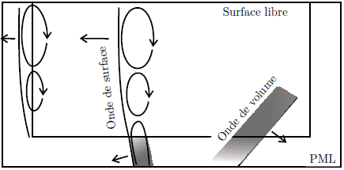

.. -*- mode:rst; coding: utf-8 -*-

======================
Prise en main de SEM3D
======================

Introduction
============

Ce chapitre présente la chaîne de calcul SEM, insistant plus
particulièrement sur SEM3D.

La chaîne logicielle SEM contient le code de simulation (``sem2d.exe``
et ``sem3d.exe``, ainsi qu'un outil de partition et préparation
de maillage ``mesher``).

L'outil ``mesher`` permet de partitionner des maillages complexes au
format abaqus, UNV ou encore un format spécifique simple (équivalent
du format UNV dans un fichier HDF5).

Outre la paramétrisation du code SEM3D, la plus grosse difficulté dans
l'utilisation du code concerne la création des maillages, qui doit
être effectuée par des outils spécialisés comme Cubit. Pour des
maillages simples stratifiés, avec éventuellement une
topographie, on peut utiliser la suite d'outils *meshtools*.

Les équations du mouvement
--------------------------

SEM résout la propagation d'onde élastique dans un milieu décrit par l'équation
locale du mouvement reliant le déplacement :math:`\mathbf{u}` en chaque point matériel, les
contraintes :math:`\sigma` et les forces extérieures :math:`\mathbf{f}` :

.. math::

   \rho \frac{\partial^2 \mathbf{u}}{\partial t^2} = div \left( \sigma \right) + \mathbf{f}

Avec, en élasticité linéaire : :math:` \sigma = C : Du`, où :math:`C` est le
tenseur élastique d'ordre 4 et :math:`Du` le gradient du champs de déplacement.

Pour l'instant les milieux de propagations décrits dans SEM sont
considérés isotropes.  Le code est prévu pour gérer les milieux
anisotropes, mais il n'existe pas de manière simple de gérer la mise
en données.

Dans le domaine fluide (hypothèse du fluide parfait) , on résout :

.. math::

   \frac{1}{\kappa}\frac{\partial^2 (\rho\phi)}{\partial t^2} = div \left( \mathbf{v} \right) + f

   \mathbf{v} = \frac{1}{\rho}\nabla(\rho\phi)

o√π :math:`\mathbf{v}` c'est le champ de vitesse du fluide, :math:`\rho` la masse volumique, :math:`\phi` un potentiel
scalaire et :math:`f` la source extérieure, et :math:`\kappa` le module d'incompressibilité. 
  
Formulation éléments finis
--------------------------

SEM est un code éléments finis, basé sur une formulation spectrale ([COH02]_), qui lui donne son nom. Le champ de déplacement :math:`\mathbf{u}` est décrit dans
chaque élément, ou maille, sur une base de polynômes de Lagrange d'ordre N (N défini comme paramètre).

.. [COH02] Cohen, G. (2002). Higher-Order Numerical Methods for Transient Wave Equations. Springer.

Méthode spectrale
~~~~~~~~~~~~~~~~~

Pour obtenir une convergence spectrale, ces polynômes de Lagrange sont
définis sur les points de Gauss-Lobatto-Legendre (GLL) de chaque
élément (voir :ref:`fig-gll`).

.. _fig-gll:

.. figure:: ../figures/elem_gll_2d.png
   :scale: 40%
   :align: center

   Position des points de Gauss-Lobatto-Legendre sur un élément 2D d'ordre 9

Les éléments traités sont des quadrangles en 2D et des Hexaèdres en
3D. Si :math:`\phi_i(x)` est le polynôme de Lagrange valant 1 au point
GLL :math:`x = x_i`, le champ de déplacement dans la direction :math:`r`, 
:math:`\mathbf{u}_r(x,y,z)` de l'élément s'exprime sur la base tensorisée 
:math:`\phi_i\left( x\right) \otimes \phi_j\left( y\right) \otimes \phi_k\left( z\right)` :

.. math::

   u_r(x,y,z) = \sum_{i,j,k} U_r(i,j,k) \phi_i(x) \phi_j(y) \phi_k(z)

Ainsi, sur un élément d'ordre 5, la composante *x* du champ de
déplacement, est décrite par un vecteur de 125 éléments
:math:`\mathbf{U}_{i,j,k}` .

La figure :ref:`pollag` montre la forme des polynômes de Lagrange d'ordre 9, la base tensorisée
de dimension 2D est représentée :ref:`fig-ref-2d`

.. _pollag:

.. figure:: ../figures/lagrange_9.png
   :scale: 40%
   :align: center

   Polynômes de Lagrange d'ordre 9.

.. _fig-ref-2d:

.. figure:: ../figures/shape_fct_9x9.png
   :scale: 60%
   :align: center

   Quelques fonctions de forme d'un élément 2D d'ordre 9

Le champ de déplacement est continu entre deux éléments adjacents, et
le maillage géré par SEM doit être conforme (toutes mailles se
touchant ont en commun un sommet, ou une arête ou une face
complète). De plus l'ordre en X, Y ou Z de chaque maille doit assurer
la conformité au niveau des points GLL en commun.

Enfin, dans ce qui précède, on a présenté la formulation de manière
simplifiée, sur des mailles cubiques, alignées en *x,y,z*. En pratique
SEM peut gérer un maillage hexaédrique quelconque (mais conforme),
composé de mailles parallélépipédiques. Dans chaque élément le code se
ramène à une base locale :math:`\phi_i(x) \phi_j(y) \phi_k(z)` par
changement de variable de la fonction de base :math:`\phi` depuis la
maille vers un élément de référence sur le segment [-1.,1.] .

Matrice de masse diagonale
~~~~~~~~~~~~~~~~~~~~~~~~~~

Enfin une des originalités de la méthode, provient du choix de la
quadrature pour l'évaluation numérique des intégrales apparaissant
dans la formulation élément finis.

On passe d'abord à la formulation faible en multipliant l'équation
locale par une fonction quelconque *w* et en intégrant (produit
scalaire dans :math:`\mathcal{L}^2`)

.. math::

   \forall \mathbf{w} \in \mathcal{L}^2, \int \mathbf{w}.\rho 
   \frac{\partial^2 u}{\partial t^2}dV = 
   \int \mathbf{w}.(div \left( C:\nabla{}u \right) + \mathbf{f})dV

En exprimant *w* et *u* sur la même base discrète
:math:`\phi_i(x,y,z)` (ici *i* indexe **toutes** les fonctions de base
de tous les éléments).

.. math::

   \forall w = \sum_{i=1}^N w_i \phi_i, w_i \in \mathbf{R},
   \sum_{i,j} w_i \rho \frac{\partial^2 u_j}{\partial t^2}\int \phi_i\phi_j dV =
     \sum w_i u_j.\int (div(C:\nabla{}\phi_j) + f_j\phi_j) \phi_i dV

Cette dernière équation apparaît alors sous la forme classique de
l'approximation de Galerkin : :math:`a(\mathbf{u},\mathbf{w}) = f(\mathbf{w})` avec :math:`a` une
forme bilinéaire.

On arrive à l'équation matricielle suivante :

.. math::

    \mathcal{M}.\frac{\partial^2 \mathbf{u}}{\partial t^2} + \mathcal{F}^{int}
    \left( \mathbf{u} \right) = \mathcal{F}^{ext}

Sans aller jusqu'au bout des développements, on voit qu'il apparaît une
matrice :math:`\mathcal{M}_{i,j}= \int \phi_i \phi_j dV`, que l'on doit
inverser si on veut obtenir une expression de :math:`\frac{\partial^2
u_j}{\partial t^2}` .

Les produits scalaires entre fonctions :math:`\phi_i` qui ne partagent
pas le même élément support sont nuls par construction. Mais au sein
d'un élément, les polynômes de Lagrange ne sont pas orthogonaux. La
méthode SEM utilise astucieusement une quadrature basée sur les mêmes
points de Gauss que les noeuds de définitions des fonctions de
base. Cela introduit bien sûr une approximation de l'intégrale, mais
le résultat est que le produit scalaire discret utilisé rend
orthogonales les fonctions :math:`\phi_i` ayant le même élément
support.

Chemin d'intégration numérique
------------------------------

La période de temps d'intérêt est discrétisée par petits intervalles :math:`\Delta t`. On 
appels :math:`\mathbf{u}_{n}`, :math:`\mathbf{v}_{n}` et :math:`\mathbf{a}_{n}` respectivement
déplacement, vitesse et accélération au temps :math:`t_{n}`.  
On considère trois paramètres d'integration :math:`\alpha, \beta, \gamma \in \left[ 0;1\right]` 
et on force l'equation d'équilibre discrétisée au temps :math:`t_{n+\alpha}` sur la forme ([KOM99]_):
        
.. math::

    \frac{1}{\Delta t}\mathcal{M} \left[ \mathbf{v}_{n+1} - \mathbf{v}_{n} \right] = 
    \mathcal{F}_{n+\alpha}^{ext} - \mathcal{F}^{int}\left( \mathbf{u}_{n+\alpha}, \mathbf{v}_{n+\alpha} \right)

.. math::
    
    \mathbf{u}_{n+\alpha} = \alpha \mathbf{u}_{n+1} + \left( 1 - \alpha \right) \mathbf{u}_{n}
 
.. math::

    \mathcal{F}_{n+\alpha}^{ext} = \alpha \mathcal{F}_{n+1}^{ext} + \left( 1 - \alpha \right) \mathcal{F}_{n+1}^{ext}

.. math::
    
    \mathbf{u}_{n+1} = \mathbf{u}_{n} + \Delta t \left[ \left( 1 - \frac{\beta}{\gamma} \right)
    \mathbf{v}_{n} + \frac{\beta}{\gamma} \mathbf{v}_{n+1} \right] + \Delta t^2 \left( \frac{1}{2} 
    - \frac{\beta}{\gamma}\right) \mathbf{a}_{n}

.. math::

    \mathbf{a}_{n+1} = \frac{1}{\gamma \Delta t} \left[ \mathbf{v}_{n+1} - \mathbf{v}_{n} \right] +
    \left( 1 - \frac{1}{\gamma} \right) \mathbf{a}_{n}

Simo et al. [SIM92]_ ont montré que le choix de paramètres :math:`\alpha=\frac{\beta}{\gamma} = \frac{1}{2}` conserve les énergie et moment linéaire et angulaire totaux. Ce chemin est indépendant de l'accélération et précis au deuxième ordre.

On peux voir cette formulation comme un chemin de type Newmark prédicteur-multicorrecteur.

Prediction (:math:`^p`) :

.. math::
    
    \mathbf{u}_{n+1}^p = \mathbf{u}_{n} + \Delta t \left( 1 - \frac{\beta}{\gamma} \right)
    \mathbf{v}_{n} + \Delta t^2 \left( \frac{1}{2} - \frac{\beta}{\gamma} \right) \mathbf{a}_{n}

.. math::

    \mathbf{v}_{n+1}^p = 0

.. math::

    \mathbf{a}_{n+1}^p = \left( 1 - \frac{1}{\gamma} \right) \mathbf{a}_{n} - \frac{1}{\gamma \Delta t} \mathbf{v}_{n}

Solution :

.. math::

   \frac{1}{\Delta t}\mathcal{M} \mathbf{\Delta v}^p = \mathcal{F}_{n+\alpha}^{ext} - \mathcal{F}^{int} 
   \left( \mathbf{u}_{n+\alpha}^p, \mathbf{v}_{n+\alpha}^p \right) - \frac{1}{\Delta t}\mathcal{M} 
   \left[ \mathbf{v}_{n+1}^p - \mathbf{v}_{n} \right]

Correction (:math:`^c`) :

.. math::

    \mathbf{v}_{n+1}^c = \mathbf{v}_{n+1}^p + \mathbf{\Delta v}^p

.. math::

    \mathbf{u}_{n+1}^c = \mathbf{u}_{n+1}^p + \frac{\beta \Delta t}{\gamma} \mathbf{v}_{n+1}^c

.. math::

    \mathbf{a}_{n+1}^c = \mathbf{a}_{n+1}^p - \frac{1}{\gamma \Delta t} \mathbf{v}_{n+1}^c

    
Conditions de bord
------------------

PML classique
..................

La condition naturelle d'un bord en élément fini est d'être une
surface libre, donc réfléchissante pour les ondes. Pour simuler des
milieux ouverts, SEM utilise un type d'élément dit *Couche Parfaitement Absorbante* (en anglais: *Perfectly
Matched Layer*, ou PML) pour simuler un milieu ouvert infini en bordure d'un
domaine ([BER94]_, [FES05]_). :ref:`PML_schema` montre le mécanisme d'attenuation des ondes.

.. _PML_schema:

   Un schéma simple d'un domaine numérique pour la propagation des ondes élastiques en présence d'une surface libre et de PML. Une onde de volume est toujours atténuée en pénétrant une PML. Les ondes de surface décroissent exponentiellement lorsqu'elles entrent dans des PML latérales, mais l'atténuation disparaît lorsqu'elles pénètrent la PML inférieure.

Dans le domaine fréquentiel, une PML correspond à un prolongement de l'espace des coordonnées réelles dans le plan complexe. Ce prolongement est obtenu par le changement de coordonnées suivant [FES05]_:

.. math:: 

   \tilde{x}=x+\frac{\Sigma\left( x \right)}{i \omega}

où :math:`\omega` est la fréquence angulaire et :math:`\Sigma\left( x \right)` une fonction arbitraire de :math:`x`, qui croît régulièrement de l'interface
avec le milieu vers le frontière externe de la couche. Une onde plane écrite sous la forme:

.. math::

   \mathbf{\Phi}\left( x,z,t\right)=\mathbf{A}e^{i\left(\omega t -k_{x}x -k_{z}z \right)}

est transformée dans la région de la PML en:

.. math::

   \mathbf{\tilde{\Phi}}\left( x,z,t\right)=\mathbf{\Phi}\left( x,z,t\right) e^{-\frac{k_{x}}{\omega}\Sigma}

avec une décroissante exponentielle indépendante de la fréquence, à cause du rapport :math:`\frac{k_{x}}{\omega}`. Le même 
comportement s'applique dans la direction :math:`z`.

Maintenant, considérons la décomposition en ondes planes d'une onde de Rayleigh se déplaçant le long d'une surface libre {:math:`z=z_{max}`}: 
La dépendance selon x de cette onde ayant les mêmes caractéristiques que celles des ondes de volume, elle obéit à la même loi de décroissance 
de l'equation précédente lorsqu'elle entre dans une PML le long de la direction :math:`x`. De plus, elle préserve la signature d'une onde de surface, soit un mouvement caractérisé par une décroissance exponentielle avec la profondeur et une polarisation elliptique rétrograde dans le plan
de propagation en surface et prograde en profondeur. L'onde évanescente peut également interagir avec la frontière inférieure du modèle, lorsque la dimension
verticale est comparable avec la plus grande longueur d'onde propagée dans le milieu élastique (:ref:`PML_schema`). 
Pour des simulations très longues, comme peuvent le demander des études de réponse sismique dans
des bassins sédimentaires où le signal reste piégé, l'instabilité générée dans les PML pollue le signal
partout dans le volume. Une solution est d'allonger en profondeur le modèle. Si :math:`\lambda` est la plus grande longueur d'onde des ondes de Rayleigh propagée
par la grille numérique, la frontière inférieure du modèle devrait être située à environ 2-3 `\lambda` pour éviter toute interférence avec l'onde de surface qui se propage.

PML filtrante (FPML)
......................
Dans le domaine fréquentiel, on peut déplacer le pôle de la transformation :math:`\tilde{x}=x+\frac{\Sigma\left( x \right)}{i \omega}` le long
de l'axe imaginaire, en remplaçant la transformation par:

.. math::

    \tilde{x}=x+\frac{\Sigma\left( x \right)}{i \omega + \omega_{c}}

En utilisant cette transformation l'onde de volume décroît dans les PML selon la formule suivante:

.. math::

    \mathbf{\tilde{\Phi}}\left( x,z,t\right)=\mathbf{\Phi}\left( x,z,t\right) e^{-\frac{k_{x}}{\omega}\frac{\omega^{2}-i \omega\omega_{c}}{\omega^{2}+\omega^{2}_{c}}\Sigma}

La décroissance exponentielle devient maintenant dépendante de la fréquence par le facteur :math:`\frac{\omega^{2}-i \omega\omega_{c}}{\omega^{2}+\omega^{2}_{c}}`.
Sa partie réelle contribue au changement d'amplitude de la décroissance, alors que sa partie imaginaire
est responsable d'un décalage en temps qui dépend également de :math:`\Sigma` :ref:`PML_filt`

.. _PML_filt:

.. figure:: ../figures/PML_fig002.png
   :scale: 80%
   :align: center

   Parties réelle et imaginaire du coefficient de décroissance, représenté en fonction de :math:`\frac{\omega}{\omega_{c}}`.

Pour :math:`\omega \to 0` et :math:`\frac{k_{x}}{\omega}` fini, les parties réelles et imaginaires tendent vers :math:`0`,
conduisant à un régime élastique. Pour :math:`\omega \to \infty`, la partie réelle tend vers :math:`1`, 
alors que la partie imaginaire disparaît: on retrouve asymptotiquement une PML standard. 
En regardant la partie réelle, cette couche ressemble à un milieu élastique à basses fréquences
et à une couche dissipative pour des fréquences plus élevées, la transition étant décrite par un filtre passe-bas
avec une fréquence de coupure autour de :math:`\omega_{c}`. Pour :math:`\omega = \frac{\omega_{c}}{2}`, on assure une absorption d'environ
:math:`\frac{1}{\sqrt{2}}` celle d'une PML standard. D'un autre côté, la partie imaginaire a un maximum pour :math:`\omega=\omega_{c}`
correspondant aussi à un décalage de phase maximum si :math:`\Sigma > 2 \pi`. Pour une fréquence de coupure égale
au quart ou à la moitié de la fréquence de la source, on peut considérer que les FPML ont presque le même
comportement que des PML standard pour des ondes de volume. Le terme de correction par rapport à une
PML classique est un terme de convolution en temps, correspondant à un filtre passe-bas de Butterworth
agissant sur le champ propagé. Des PML filtrantes d'ordre élevé peuvent être ainsi construites à partir
de fonctions de transfert d'ordre élevé de filtres de Butterworth pour une absorption plus efficace. Les
FPML augmentent ainsi le nombre de variables à stocker.\\

Remarque Importante : dans la version actuelle de SEM, les directions d'atténuation des PMLs doivent être alignées avec les axes globaux du modèle. Cela implique entre autres que les faces des PMLs doivent être parfaitement planes. Ceci sera amené à évoluer.

Intégration temporelle
----------------------

Le schéma d'intégration est un schéma de Newmark explicite ([NEW59]_, [HUG87]_, [SIM92]_).

Le pas de temps d'intégration :math:`\Delta t` dans SEM est calculé automatiquement à
partir du nombre de Courant :math:`\mathcal{C}<1` (paramètre de configuration) selon :

.. math::

   \Delta t = \mathcal{C} \frac{\min \Delta{x_{GLL}}}{V_{max}}

où :math:`\min 	\Delta{x_{GLL}}` est la distance minimum entre deux points GLL et :math:`V_{max}` la vitesse maximum des matériaux considérés dans le modèle.
   
Attention:

   Des mailles trop petites, ou des vitesses de propagation trop
   importantes vont faire chuter le pas de temps.

.. [NEW59] Newmark, N. M. (1959). A method of computation for structural dynamics, *J. Eng. Mech., ASCE 85*, 67-94.

.. [HUG87] Hughes, T. J. R. (1987). The finite element method, linear static and dynamic finite element analysis. Englewood Cliffs, NJ : Prentice-Hall International.

.. [SIM92] Simo, J. C. (1992). Algorithms for static and dynamic multiplicative plasticity that preserve the classical return mapping schemes of the infinitesimal theory. *Comp. Meth. Appl. Mech. Eng. 99*, 61–112.

   [KOM99] Komatitsch, D. et al. (1999). Introduction to the spectral-element method for three dimensional seismic wave propagation. Geophys. J. Int. 139(3), 806-822.

Résolution spatiale
-------------------

Le maillage doit également être suffisamment résolu pour capturer les
fréquences spatiales du signal que l'on veut propager. On considère
que 10 points GLL par longueur d'onde sont suffisants.

Augmenter l'ordre des éléments est donc un moyen d'obtenir une
résolution spatiale correcte avec un maillage donné. La convergence
spatiale étant rapide, augmenter l'ordre devrait permettre de baisser
le nombre de points par longueur d'onde nécessaire, mais cela augmente
doublement les coûts de calcul :

- la complexité est en :math:`N^3` par points GLL,

- le pas de temps est proportionnel à :math:`\frac{1}{\min \Delta x}`,
  le pas d'espace :math:`\min \Delta x` diminuant avec l'ordre des
  éléments (On voit sur :ref:`fig-gll` comment les points de Gauss se
  resserrent vers les bords avec l'augmentation de l'ordre).

Atténuation
-----------

Un mécanisme d'atténuation sismique des ondes P et S est implémenté,
sous forme d'une série de filtres répartis sur une bande de
fréquence. (voir [KOM98]_)

Description des sorties
-----------------------

Les résultats de simulation peuvent être obtenus sous deux formes :

- Des instantanés (*snapshot*) des champs obtenus sur tous les points GLL, ou sur
  une sous-partie, à une fréquence donnée. Ces sorties sont en général
  assez lourdes et ne peuvent être trop fréquentes.

- Des sorties *capteurs*, pour un ou plusieurs points du maillage, on
  sort les valeurs du champ toutes les N itérations de calcul.

Les champs disponibles sont :

============= ====== ======== ========
Champ         Milieu Snapshot Capteurs
============= ====== ======== ========
Déplacement   S      Oui      Oui
Vitesse       S/F    Oui      Oui
Accélération  S/F    Oui      Non
Pression      S/F    Oui      Non
============= ====== ======== ========

Pour les instantanés, il existe un mécanisme de sélection de mailles
qui permet de ne sauvegarder qu'une partie du maillage. Cependant on
ne peut sélectionner que des mailles complètes (donc avec tous ses
points GLL), et pour l'instant, on ne peut pas, sauf en
post-traitement, re-interpoler les fonctions de formes sur un maillage
plus grossier.

Présentation des outils
=======================

Deux exécutables sont impliqués directement dans l'utilisation de SEM :

- :program:`mesher` et :program:`sem3d.exe` pour le cas 3D,

- :program:`sem2d.exe` pour le cas 2D, il n'existe pas encore d'outil de
  partitionnement simple à utiliser.

:program:`mesher` transforme un maillage d'entrée en un maillage partitionné
utilisable par SEM. On peut lui fournir différents formats :

- Un maillage au format *Abaqus* (d'extension ``.aba``)

- Un maillage au format *UNV*, (aussi connu sous le nom *IDEAS*)
  d'extension ``.unv``.  Les *UNiVersal files* (source: http://www.sdrl.uc.edu/universal-file-formats-for-modal-analysis-testing-1/file-format-storehouse)
  sont des fichiers ASCII qui peuvent être utilisés
  pour stocker des informations sélectionnées à partir d'un fichier
  de modèle. Blocs d'information appelés *datasets*  constituent la
  structure de base d'un fichier universel.
  SEM peut lire les blocs suivantes:

    - Dataset **2411** : noeuds avec leurs coordonnées 3D;

    - Dataset **2412** : éléments finis (2D et 3D) avec leur connectivité
      nodale;

    - Dataset **2477 ou 2467** : *Groupes physiques* (*PhysicalVolume* et
      *PhysicalSurface*) ils sont des ensembles d'éléments finis avec
      les mêmes propriétés (par exemple des éléments finis à l'intérieur
      de le même matériau, les surfaces physiques à être affectés avec
      des conditions limites).

- Un maillage au format *HDF5*, spécifique, dont la structure est
  décrite en détails dans :ref:`Format HDF5`.

- Le quatrième format est simplement la description d'un maillage
  cartésien, pour lequel on entre manuellement les coordonnées et la
  subdivision de la grille souhaitée.

L'outil :program:`mesher`, en plus de ses entrées en ligne de commande,
s'appuie sur un fichier externe ``mat.dat``, donnant quelques
informations sur le maillage à générer : nombre de matériaux, présence
d'éléments PML, type de matériau (solide ou fluide).

Préparation d'un cas de calcul
------------------------------

Pour lancer un calcul SEM, il faut se placer dans le répertoire du cas et y placer
les fichiers nécessaires à son exécution. L'arborescence doit être la suivante ::

  CAS/
  |- input.spec
  |- material.input
  |- sem/
  |  |- mesh4spec.0000
  |  |- ...
  |  |- mesh4spec.NNNN  

:file:`input.spec` :

  Ce fichier contient la configuration du code (voir :ref:`input.spec`):
  - paramètres d'intégration temporelle, temps physique du calcul,
  - description de la ou des sources,
  - description des sorties capteurs,
  - description des sorties snapshots.

:file:`material.input` :

  Ce fichier contient la description de chaque matériau : :math:`\rho, V_p, V_s`, un nombre
  de points GLL par direction de la maille de référence.

  Le format du fichier est le suivant :

  - la première ligne contient le nombre de milieux décrits

  - Une ligne par milieu, contenant :

    - le type de milieu (Solide, Fluide, Random, PML solide (P)m PML fluide (L) )

    - Les vitesses d'ondes P, et S

    - La densité

    - L'ordre des √©l√©ment(La m√me ordre est inpos√e pour X, Y et Z)

    - Les atténuations d'ondes P et S par les paramètres :math:`Q_\kappa` et :math:`Q_\mu`.

  - 2 lignes de commentaires

  - Pour chaque milieu de type PML (donc P ou L), une ligne indiquant les directions d'atténuation,
    et le type d'atténuation :

    - Un caractère pour le type de PML (filtrante (T), ou standard (F))

    - paramètres n et A pour les PML filtrantes

    - 3 couples de deux param√tres indicant le point de d√©but de la PML et la taille de l'extrusion de la PML
      Respectivement X, Y et Z  
      Tailles n√gatives doivent √™tre uti√©es si l'extrusion est dans le sense n√©gatif de axe. 

    - La fréquence de coupure en cas de PML filtrant

    - Le nombre du matériel avec lequel la PML fait interface

  - 5 lignes de commentaires

  - Pour chaque millieu de type Random (R), 

    - Choix de paramétrisation (0 for mu, kappa, rho and 1 for mu, lambda, rho)

    - 3 lignes avec les param√tres statistiques de chaque millieu Random
      
      Modèle de Correlation (1 pour Gaussian)
      3 Tailles de correlation, repectivement X, Y et Z
      Marginal d'ordre 1 (1 pour Gaussianne, 2 pour lognormal)
      Coeficient de variation
      Choix du germe aléatoire (si ce chiffre est plus petit que 0 le germe sera choisi selon le clock du processeur) 

  Exemple ::

    27
    S  6300.00  2500.00   2800. 5   5    5  0.000005 600. 300.
    P  6300.00  2500.00   2800. 7   7    5  0.000005   0.   0.
    P  6300.00  2500.00   2800. 7   7    5  0.000005   0.   0.
    R  6300.00  2500.00   2800. 5   5    5  0.000005 600. 300.
    # PML properties
    # npow,Apow,posX,widthX,posY,widthY,posZ,widthZ,mat
    2 10. 0.000000 -1.000000 0.000000 -1.000000 50.000000 1.000000 0
    2 10. 0.000000 0.000000 0.000000 -1.000000 50.000000 1.000000 0
    # Random properties
    # Parametrization Choice (0 for Kappa, 1 for Lambda)
    # Rho            : corrMod, corrL_x, corrL_y, corrL_z, margiF, CV, seedStart
    # Kappa or Lambda: corrMod, corrL_x, corrL_y, corrL_z, margiF, CV, seedStart
    # Mu             : corrMod, corrL_x, corrL_y, corrL_z, margiF, CV, seedStart
    0
    2 30.0 30.0 30.0 2 0.3 0
    2 30.0 30.0 30.0 2 0.3 1
    2 30.0 30.0 30.0 2 0.3 -1
     
:file:`capteurs.dat` :

  Contient les coordonnées X Y Z des capteurs, un capteur sur chaque ligne,
  pour les capteurs de type "points". Les noms des capteurs produits
  sont le nom de la section suivi du numéro de la ligne du capteur
  (commençant à zéro).

Le fichier :file:`input.spec` est décrit en détails dans la section
_`Description des paramètres de SEM3D`.

Des exemples de fichiers :file:`material.input` et :file:`capteurs.dat` sont
disponibles dans les tests du code. Ces derniers sont de simples
tables de paramètres.

Exemples de modélisation avec SEM3D
===================================

Problème de solide stratifié fluide avec PML en demi-espace
-----------------------------------------------------------

On présente ici un cas test en expliquant tous les paramètres entrés
et les mots clés utilisés pour lancer des calculs avec SEM3D. Il s'agit d'un
cas de surface libre (demi espace) avec le sol stratifié et fluide
entouré par des PMLs.

Pour préparer le lancement d'un calcul SEM, dans le répertoire du cas,
il faut avoir 6 fichiers qui sont mesh.input, mat.dat [#]_, mater.in,
material.input [#]_, input.spec, capteurs.dat.

.. [#] Le fichier "mat.dat" n'est nécessaire quand dans le cas du
       maillage automatique. Pour le cas d'un maillage externe comme
       UNV ce fichier n'est pas nécessaire.

.. [#] Le fichier "material.input" n'est pas nécessaire dans le
       cas du maillage automatique car ce fichier va être créé
       automatiquement au moment de la création du maillage.

La description de chaque fichier est la suivante:

1) :file:`mesh.input` : il indique le nombre de processeurs, et le type de
   maillage qui va être généré. Ce fichier [#]_ doit contenir ::

     8   #nombre de processeurs
     1   #type de maillage
         # 1 : on the fly
         # 2 : Abaqus par Cubit
         # 3 : fichier UNV
         # 4 : HDF5 Hex8
         # 5 : Earth Chunk

.. [#] Attention ce n'est pas exactement un fichier d'entrée, c'est un
       fichier qui contient ce que le :program:`mesher` doit avoir sur
       son entrée standard (ie le fichier doit être redirigé sur
       l'entrée de :program:`mesher`)

2) :file:`mat.dat` : il présente la géométrie du maillage (automatique). Pour
   le cas test présenté ici, on est dans le cas d'un demi-espace. Ce
   fichier doit contenir ::

     -100.    # xmin
     500.     # xmax
     50.      # xstep
     -100.    # ymin
     500.     # ymax
     50.      # ystep
     500.     # zmax
     3       # nb. of layers
     300 6   # upper layer: thickness and nb of steps
     300 6   # midle layer: thickness and nb of steps
     300 6   # lower layer: thickness and nb of steps
     1   # PMLs? 0: no, 1: yes
     0 1   # PMLs on top? at the bottom? (0: no, 1: yes)
     5   # nb of GLL nodes in the PML
     1   # 8 or 27 control points for elements (1 or 2)

3) :file:`mater.in` : il décrit le nombre de couches du milieu et les
   propriétés du matériaux. Le :program:`mesher` va utiliser ce fichier pour
   générer le fichier :file:`material.input` dans le cas du maillage
   automatique. Ce fichier doit contenir ::

     3   # nombre de couches
     F  6300.00    00.00    1.0  5   5    5  0.000005 630. 250.
     S  6300.00  2500.00   2800. 5   5    5  0.000005 630. 250.
     S  5000.00  2000.00   2000. 5   5    5  0.000005 630. 250.
     # Type de milieu, Vp, Vs, Rho, N-GLLx, N-GLLy, N-GLLz, dt, Qk, Qmu

     # Type de milieu : (S:Solide, F:Fluide)
     # Vp et Vs : Vitesse de propagation des ondes P et S
     # Rho : Masse Volumique
     # N-GLLx, N-GLLy, N-GLLz : Nombre de points GLL dans les 
     #                    trois directions (N-GLLy est ignoré en 2D)
     # dt : Pas de temps (pour l'instant, il est ignoré)
     # Qk et Qmu : Facteurs de qualité d'atténuation des ondes P et S

4) :file:`material.input` : Ce fichier va être créé par le :program:`mesher` au moment de
   la génération du maillage. Il décrit toutes les propriétés des
   matériaux, les PMLs et les directions de PMLs.

5) :file:`input.spec` : Ce fichier décrit le chargement, limite le temps de
   simulation, et spécifie les zones du maillage à sauvegarder dans
   les fichiers résultat. Il doit contenir ::

     # -*- mode: perl -*-
     run_name = "Cube_PML";

     # duration of the run
     sim_time = 5.0;
     mesh_file = "mesh4spec"; # input mesh file
     mat_file = "material.input";
     dim=3;

     snapshots {
         save_snap = true;
         snap_interval = 0.01;
         deselect all;
         select box = -100 -100  100 500 500 150;
         select box = -100  100 -100 500 150 500;
         select box =  100 -100 -100 150 500 500;
     };

     # Description des capteurs
     save_traces = true;
     traces_format=hdf5;

     capteurs "A" {
       type = points;
       file = "capteurs.dat";
       period = 10;
     };

     # Fichier protection reprise
     prorep=false;
     prorep_iter=1000;
     restart_iter=370;

     # introduce a source
     source {
         # coordinates of the sources ((x,y,z) or (lat,long,R) 
         #                            if rotundity is considered)
         coords = 25. 25. 0.;
         # the numbers before the labels are here to help convert  
         #                            from previous input.spec format
         # Type (1.Impulse, 2.moment Tensor, 3.fluidpulse)
         type = impulse;
         # Direction 0.x,1.y ou 2.z (only for Impulse)
         dir = 1. 0. 0.;
         # Function 1.gaussian, 2.ricker, 3.tf_heaviside, 4.gabor,  
         #                               5.file,6.spice_bench,7.sinus
         func = ricker; 
         tau = 0.4;
         freq = 3.;   # source main frequency / cutoff frequency
     };

     time_scheme {
         accel_scheme = false;  # Acceleration scheme for Newmark
         veloc_scheme = true;   # Velocity scheme for Newmark
         alpha   = 0.5;           # alpha (Newmark parameter)
         beta    = 0.5;           # beta (Newmark parameter)
         gamma   = 1;             # gamma (Newmark parameter)
         courant = 0.2;
     };

     amortissement {
         nsolids = 0;           # number of solids for attenuation  
                                #                (0 if no attenuation)
         atn_band = 10  0.05;   # attenuation period band
         atn_period = 0.2;      # model period
     };

     capteurs "ligne" {
     type = line;
     counti = 50;
     point0 = 0. 0. 0.;
     point1 = 0. 5000. 0.;
     periode = 1;
     };

Lancement du cas
----------------

Il faut d'abord préparer le répertoire du CAS : y copier les fichiers
:file:`input.spec`, :file:`material.input`, :file:`capteurs.dat`, et placer les fichiers
:file:`mesh4spec.NNNN` dans le sous-répertoire ``sem/``.

On doit obtenir l'arborescence suivante ::

  mon_cas/
  |- input.spec
  |- material.input
  |- capteurs.dat
  |- mat.dat
  |- sem/
  |  |- mesh4spec.0000.h5
  |  |- mesh4spec.0001.h5
  |  |- mesh4spec.0002.h5
  |  |- mesh4spec.0003.h5

Visualisation des résultats
---------------------------

Les résultats sont de deux sortes :

- Des instantanés (mot-clef *snapshot* du fichier de config)
  sauvegardés dans le répertoire ``res/`` : les sorties sont au format
  HDF5, directement visibles avec **paraview**, ou ensight en
  ouvrant le fichier ``.xmf`` associé (Format XDMF).

- Des sorties capteurs, au format texte ou hdf5 (paramétrable par
  fichier de config).  Le format HDF5 n'a d'utilité que pour un grand
  nombre de capteurs sur des systèmes de fichier distribués.

Protection reprise
------------------

Il est possible de reprendre le calcul après un arrêt à partir de la dernière *protection*.
Les fichiers de protection sont des répertoires placés dans le répertoire ``prot`` et portant
le numéro de l'itération de protection.

Pour relancer le calcul à partir d'une protection, il faut renseigner le numéro d'iteration
avec le mot-clef ``restart_iter`` et indiquer que l'on veut redémarrer depuis une reprise :
mot-clef ``prorep`` valant ``true``.

Le mot-clef ``prorep_iter=NIT`` indique au code d'effectuer une protection toutes les ``NIT`` itérations.

Maillage d'une topographie
==========================

Génération du maillage
----------------------

Pour générer ce cas on va utiliser un jeu d'outils externes à SEM : *meshtools*.

Les étapes de construction sont les suivantes :

- Sélection d'un ou plusieurs fichiers de topographie (format SRTM par exemple) (*utilisateur*)

- Conversion/concaténation de la topographie en un format compact intermédiaire (*mt_import*)

- Création d'une grille cartésienne dans la projection souhaitée (*mt_grid*)

- (optionnel) Création de grilles supplémentaires pour mailler des couches en profondeur épousant la topographie
  de surface (*utilisateur*)

- Génération du maillage et du fichier matériau associé (*mt_topo*)

- Partition du maillage (*mesher*)

Nous allons traiter un exemple de génération de maillage à partir d'un fichier srtm ::

  # On décompresse le fichier srtm
  $ unzip srtm_56_01.zip
  # On convertit le fichier au format hdf5 (lat/lon)
  $ mt_import -s topo_srtm.h5 srtm_56_01.tif
  # On projete une grille de 30x30 mailles de 1000x1000 m de cote  
  #                            d'origine 58N 96E dans la projection aeqd
  $ mt_grid --vx=1000,0 --vy=0,1000 -g 30,30 -p \
           "+proj=aeqd +lat_0=58.0 +lon_0=96.0" \
                   -n surf topo_srtm.h5 grid.h5
  $ mt_grid --vx=500,0 --vy=0,500 -g 300,300 -p \
            "+proj=aeqd +lat_0=58.0 +lon_0=96.0" \
                        -n surf topo.h5 grid.h5
  # Le fichier contenant la grille est utilise pour creer un maillage
  $ mt_topo --npml=1 --profile=mesh.profile \
         —mat=input_material.dat grid.h5 mesh_sem.h5
  # on renomme le fichier materiau (pour l'outil mesher)
  $ cp mesh_sem.h5.mat material.input
  $ mesher
  256
  0
  4
  1
  mesh_sem.h5
  $ mkdir sem
  $ mv mesh4spec.0* sem/
  # Lancement du cas sem
  $ mpirun -n 256 sem3d.exe

Modification d'une surface
--------------------------

Les surfaces sont générées dans le fichier :file:`grid.h5` par :program:`mt_grid` ci-dessus.

Ce sont des datasets HDF5 que l'on peut manipuler en python ainsi :

1. Lancement de python ::

   $ python

2. Lecture ::

    >>> import h5py
    >>> from numpy import *
    >>> f = h5py.File("grid.h5")
    >>> X = f["surf"]["X"][...]
    >>> Y = f["surf"]["Y"][...]
    >>> Z = f["surf"]["Z"][...]

3. Modification (exemple on multiplie par une fonction) ::

    >>> xs = 0.
    >>> ys = 0.
    >>> r0 = 5000.
    >>> kr = 10.
    >>> kz = tanh( r0 - kr*((X-xs)**2 + (Y-ys)**2) )
    >>> f["surf"]["Z"][...] = kz*Z

4. Fermeture du fichier ::

    >>> f.close()

Modification de l'association des matériaux
-------------------------------------------

L'outil :program:`mt_topo` via le fichier de profil vertical (option ``--profile``) applique une description
de milieu homogène par couche de mailles (pas de variation en X et Y).

On peut cependant aller plus loin et modifier le maillage généré avec quelques lignes de script python ::

  $ python
  # import des fonctions numpy
  >>> from numpy import *
  # Import du module de lecture de fichier HDF5
  >>> import h5py
  # Ouverture du fichier
  >>> fmesh = h5py.File("mesh_sem.h5","r+")
  # On lit les coordonnees des noeuds (taill Np x 3)
  >>> nodes = fmesh["/Nodes"][...]
  # On charge les proprietes materiau (taille Nel)
  >>> mat = fmesh["/Mat"][...]
  # On charge la description des elements Nel x 8
  >>> elem = fmesh["/Elements"][...]
  # On calcule le centre de chaque element nodes[elem,:] est un tableau
  # de taille Nel x 8 x 3, on fait la moyenne des coordonnees sur l'axe du milieu
  >>> ctr = nodes[elem,:].sum(axis=1)/8.
  # on applique un nouveau materiau sur la zone d'interet :
  >>> z1 = logical_and( ctr[:,0] > 5000, ctr[:,0] < 10000. )
  >>> z2 = logical_and( ctr[:,1] > 2000, ctr[:,1] < 4000. )
  >>> z3 = ctr[:,2] > -5000
  # Un tableau de booléen de taille Nel tq les valeurs true correspondent aux
  # élements de centre 5000<X<10000 , 2000<Y<4000, Z>-5000
  >>> zone = logical_and(z1, logical_and(z2, z3))
  # On change le materiau associé à cette zone
  >>> mat[zone] = 2
  # On récrit le nouveau champ matériau
  >>> fmesh["/Mat"] = mat
  # Fin
  >>> fmesh.close()

==================
Gestion des tests
==================

Il y a un outil qui gère le lancement des tests et la génération d'un
rapport de test. \\
Il n’est pas spécifique à SEM. Par contre, des développements
spécifiques ont été fait pour traiter plus particulièrement
les sorties de les codes SEM2D et SEM3D.\\
La documentation Validationtools.pdf [disponible dans le répertoire
$Valid-tools/doc/source$]décrit en détails l'organisation et la
construction des tests, la structure du rapport de test,la création
d'un jeu de tests, les données d'entrée que l'auteur d'un cas test
devra fournir pour s'intégrer correctement dans cette infrastructure
voire les routines de support spécifiques à certains codes.
